```{r setup, include=FALSE}
knitr::opts_chunk$set(echo = FALSE)
```

# 3. What is `git` and how can I use it?

## What I would like to show you about `git`

<div class="left-col">
* How to use a terminal
* Git
  + What is it good for?
  + What is it?
  + What can it do?
* Set-up for your computer
  + GUI/terminal
  + R Studio & git
  + SSH
  + Set name & email address
</div>

<div class="left-col">
  + Your first repo
    - Github and GitLab
    - In R Studio
    - gitignore
    - README

* Workflow
  + Add, Commit, Push
  + Diff
  + Merge, Branches, Tagging... (all the cool stuff)
  + What happens if something goes wrong? (And it will.)

</div>

## What we have time for

<div class="left-col">
* *How to use a terminal*
* Git
  + **What is it good for?**
  + **What is it?**
  + What can it do?
* Set-up for your computer
  + *GUI/terminal*
  + **R Studio & git**
  + *SSH*
  + Set name & email address
</div>

<div class="left-col">
  + Your first repo
    - *Github and GitLab*
    - **In R Studio**
    - **gitignore**
    - **README**

* Workflow
  + **Add, Commit, Push**
  + Diff
  + Merge, Branches, Tagging... (all the cool stuff)
  + What happens if something goes wrong? (And it will.)

</div>

## What is it good for?

**Version control:**

>- Version control is a system that records changes to a file or set of files over time so that you can recall specific versions later.
>- History of all changes (who, what, when).
>- Helps to avoid mistakes (working on the wrong version, deleting, ...).
>- Merging changes of multiple collaborators in one file.


## What is it?

>- Git is a essentially a programm on your computer, you have to communicate with it.
>- Github (or gitlab) is a Git repository hosting service.

## What is it?

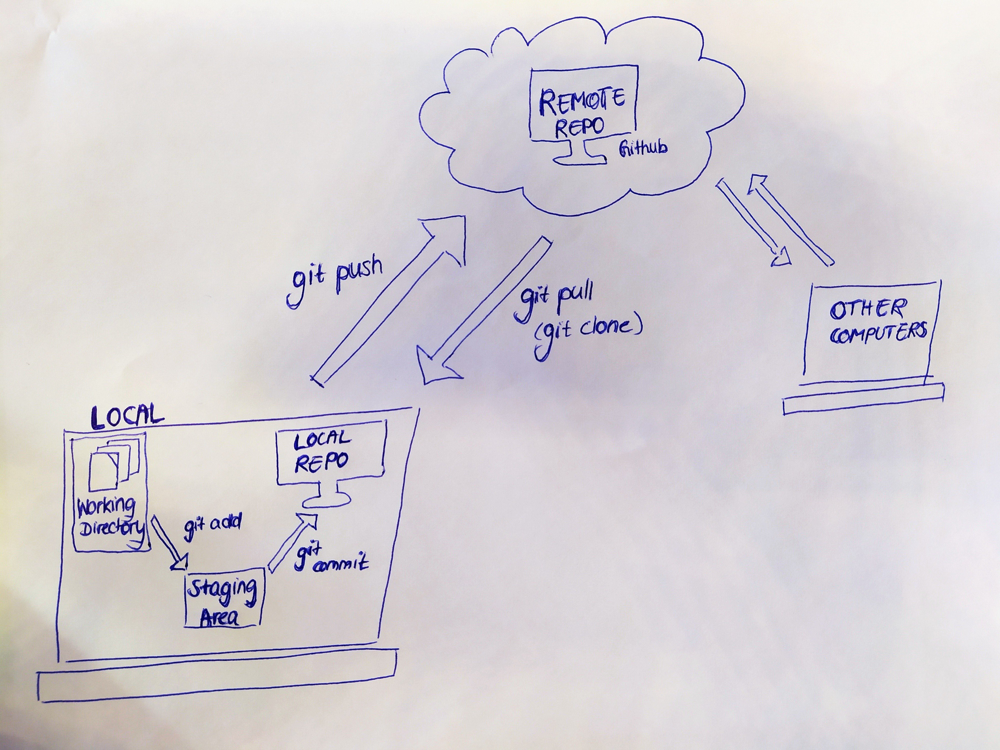

## What can it do?

- A lot! Which is why I can only mention part of its functionality here.
- Working on one product in (large) teams.
- Working on things that can break.
- git can only integrate and show changes in text files.
- binary files (images, etc.) can be tracked and uploaded but changes cannot be shown.

# Set-up for your computer

## Using git

>- Git does not have a user interface. 
>- You can either use the terminal, or install an additional interface.
>- Github has its own GUI. Some people like it. 
>- We will use Rstudio as user interface.

## R Studio & git


## R Studio & git

Tools &#10148; Global Options &#10148; Git/SVN.

Make sure the first box is ticked and the "git.exe" (Windows) is included in the first box.


## Set name & email address

>- Open the Terminal in R Studio.
>- Set an email address and user name for git.

## Set name & email address

- Open the Terminal in R Studio.
- Set an email address and user name for git.

```{r eval = F, echo = T}
git config --global user.email "myemail@email.com"
git config --global user.name "My commit name"
```

# First Repository!

## Github 

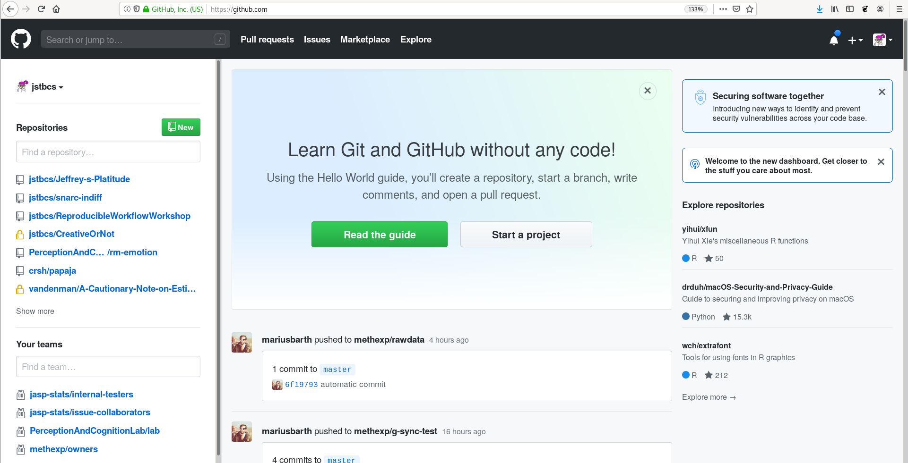

## Github | New Repository

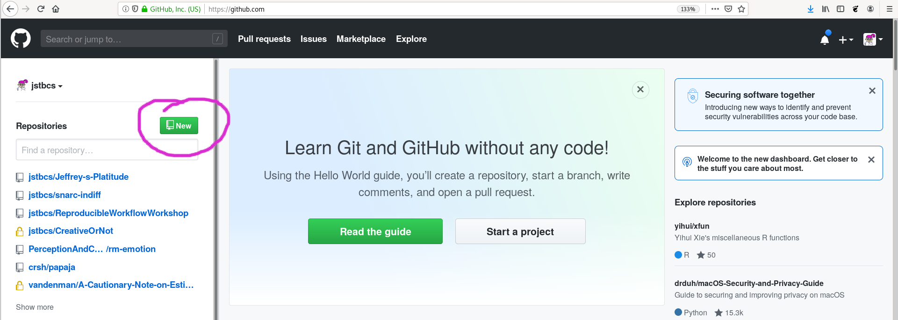

## Github | New Repository

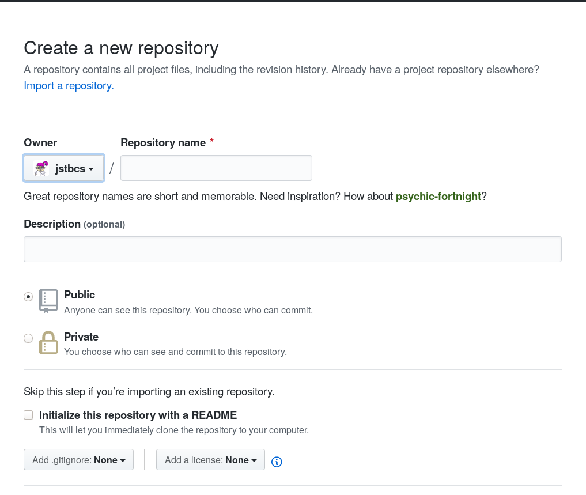

## Github | New Repository


## Github | Settings

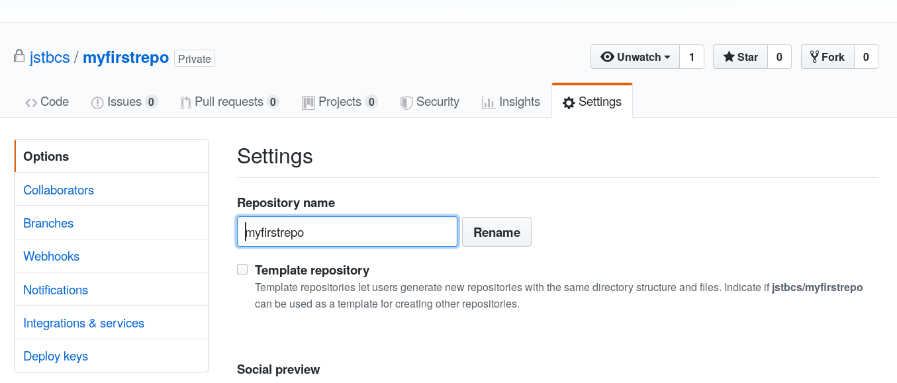

## Github | Settings

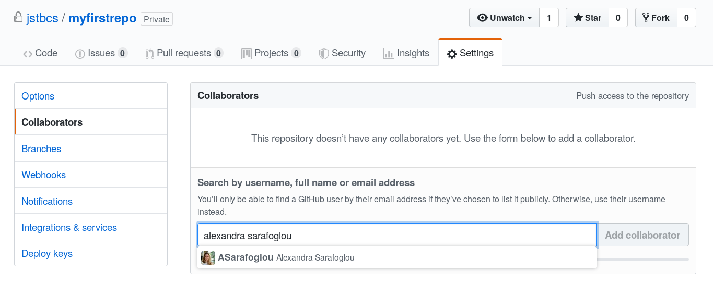

## Github | Settings

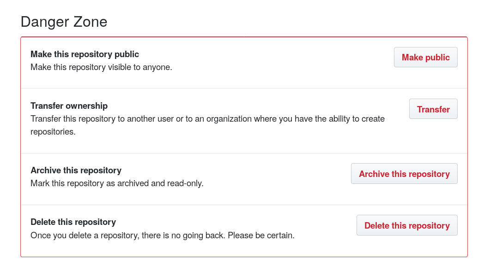

## Github | Clone It!


## In R Studio

File &#10148; New Project &#10148; Version Control &#10148; Git

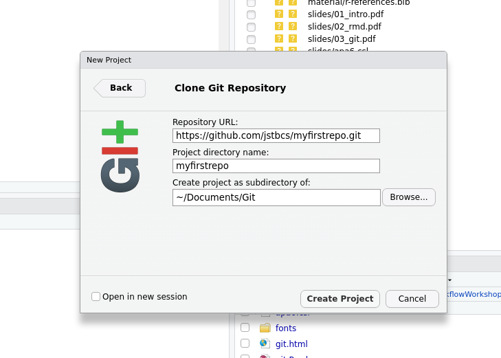

## In R Studio

- You will have to type in you user name and password for github.
- Initializes a local git repository with an R project (opening a clean R Studio session when opening).
- You can see the README file from github.
- Adds a `.gitignore` file.

<br>


<!-- ## Task IV -->

<!-- - Make a new repository. -->
<!-- - Clone it using R Studio to make a local repository. -->

<!-- <br> -->

<!-- <br> -->

<!--   -->

## gitignore

>- Specifies intentionally untracked files to ignore.
>- Each line in a `gitignore` file specifies a pattern.
>- R Studio pre-specifies some useful patterns.
>- For R Markdown: Cache files! .tiff, .eps, .rdb, .rdx

<br>

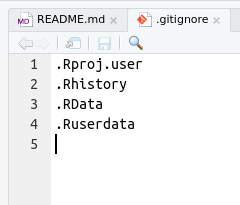


## README

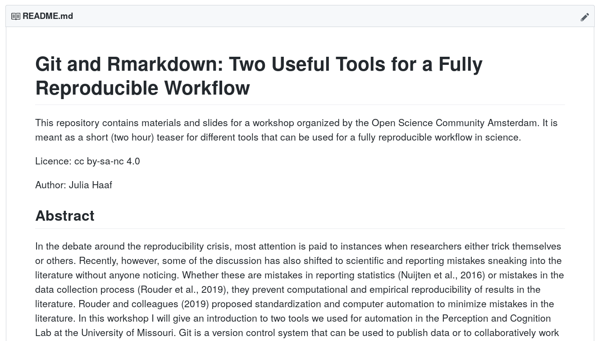

## README

>- Tell other people (and yourself in a year) why your project is useful, what they can do with your project, and how they can use it.
>- On github default README files are Markdown files!

<!-- ## Task V -->

<!-- - Write a (short) README file for your test repository.  -->
<!-- - Use Markdown formatting. -->

<!-- <br> -->

<!-- <br> -->

<!--   -->

# Git Workflow

## Do some work

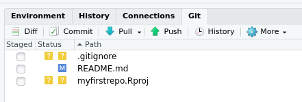 

## Git Add

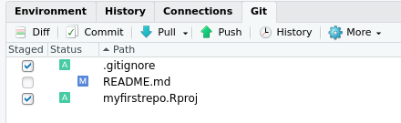 

<br>

```{r eval = F, echo = T}
git add .gitignore myfirstrepo.Rproj
```

<br>

- `git` can do autocomplete for file names!
- Note that many user interfaces combine `git add` and `git commit` (next step).

## Git Commit

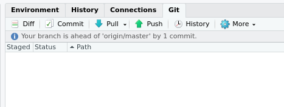 

<br>

```{r eval = F, echo = T}
git add .gitignore myfirstrepo.Rproj
git commit -am "My first commit"
```

<br>

<br>

Commits always have a commit message.

## Commit message

<br>

 

## Git Push

 

<br>

```{r eval = F, echo = T}
git add .gitignore myfirstrepo.Rproj
git commit -am "My first commit"
git push
```

Congrats! You have done it! Now local and remote repositories are up to date!

<!-- ## Task VI -->

<!-- - Add your unstaged files. -->
<!-- - Commit the changes. -->
<!-- - Push to the remote repository. -->

<!-- <br> -->

<!--   -->

## Git Pull

Before you start working on the project the next time:

<br>

```{r eval = F, echo = T}
git pull
```

<br>

Pull, work some more, repeat.

## What changed since the last commit?

```{r eval = F, echo = T}
git diff
```

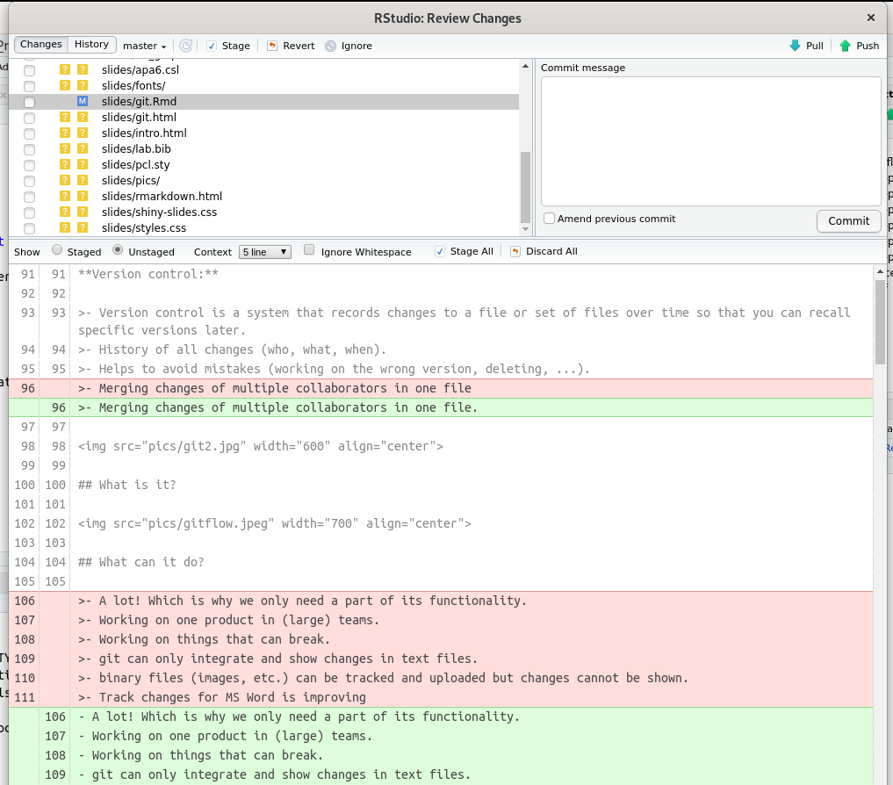 

## What happens if something goes wrong? (And it will.)


## What happens if something goes wrong? (And it will.)

First things first: You cannot break things.

## What happens if something goes wrong? (And it will.)

Read the output!

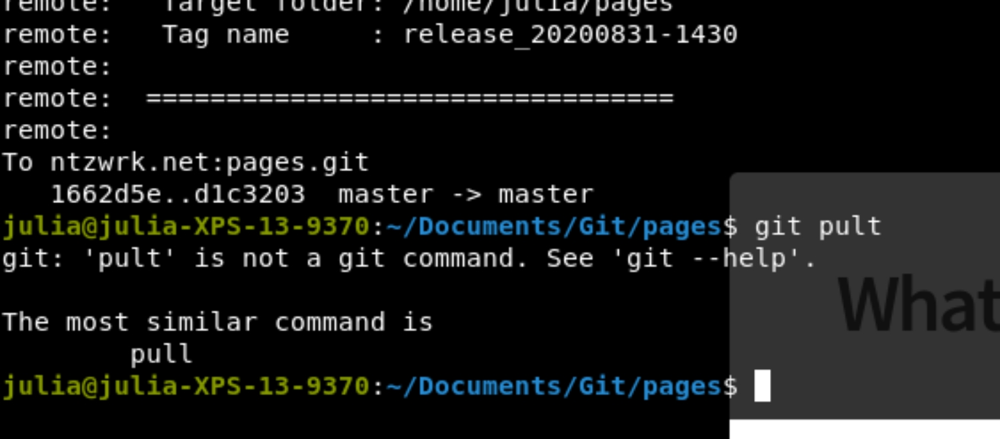

## Push Conflict

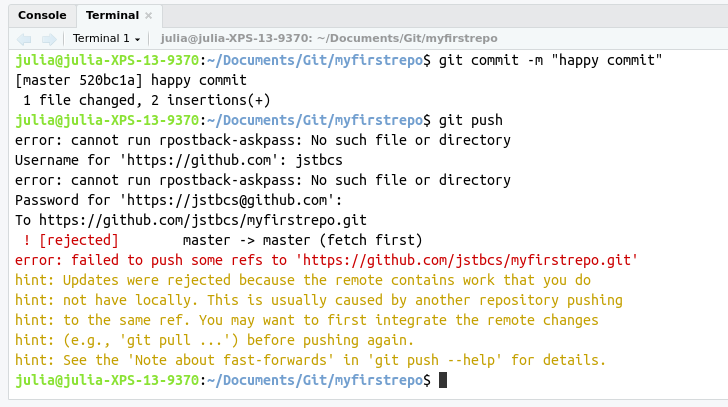 

## Merge Conflict

 

## Merge Conflict

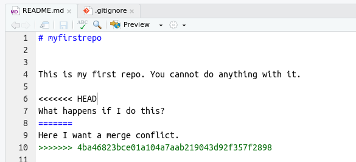 

>- Resolve the conflict (Choose which changes to keep).
>- Commit, and Push.

## How to avoid merge conflicts | Or: Do not mess with the master

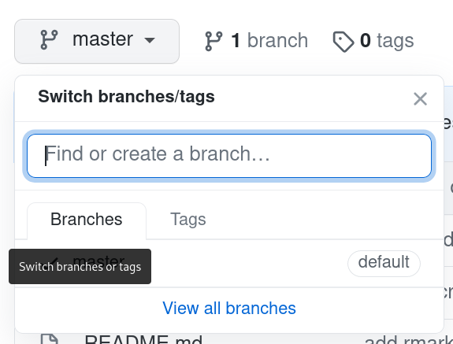 

## Do not mess with the master

>- The master branch is *deployable*: It contains the final product code.
>- This is not where people work.
>- Instead you use *branches* for development and then *merge* the code into the master branch once you are done.

## Do not mess with the master

 

## Do not mess with the master

I don't really have time to get into this

>- Here is the best [tutorial](https://thenewstack.io/dont-mess-with-the-master-working-with-branches-in-git-and-github/) I could find on branches: [https://thenewstack.io/dont-mess-with-the-master-working-with-branches-in-git-and-github/](https://thenewstack.io/dont-mess-with-the-master-working-with-branches-in-git-and-github/).
>- For working in a professional environment: A tutorial on pull requests: [https://www.atlassian.com/git/tutorials/making-a-pull-request](https://www.atlassian.com/git/tutorials/making-a-pull-request)

## Summary

>- Add, commit, push, pull.
>- Use it!
>- git documentation and error tracking are great!

## Your turn! 

- Let's make breakout rooms
- Then complete the in-class assignment. 

<br>


## References

Additional info (in the [material folder](../material/git-tutorial.pdf)):

Vuorre, M., & Curley, J. P. (2018). Curating Research Assets: A Tutorial on the Git Version
Control System. *Advances in Methods and Practices in Psychological Science, 1*(2), 219–236.

<style>
slides > slide {
  overflow-x: auto !important;
  overflow-y: auto !important;
}
</style>

<style>
slides > slide:not(.nobackground):before {
  background: none;
}
</style>

<font size="3">
<div id = "refs"></div>
</font>


