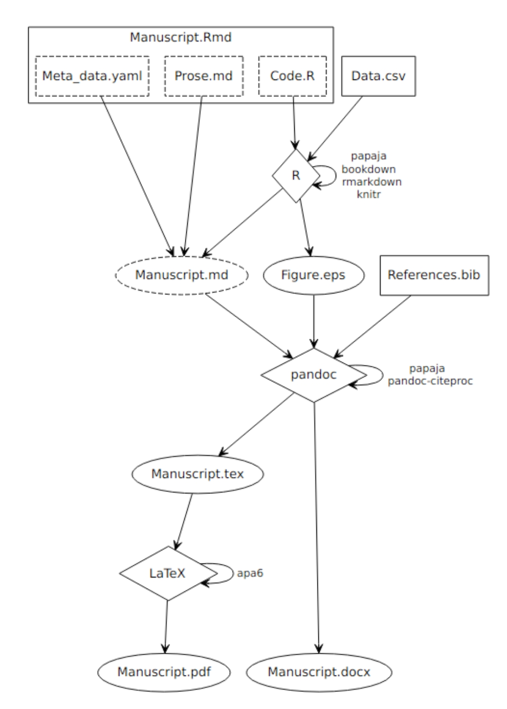
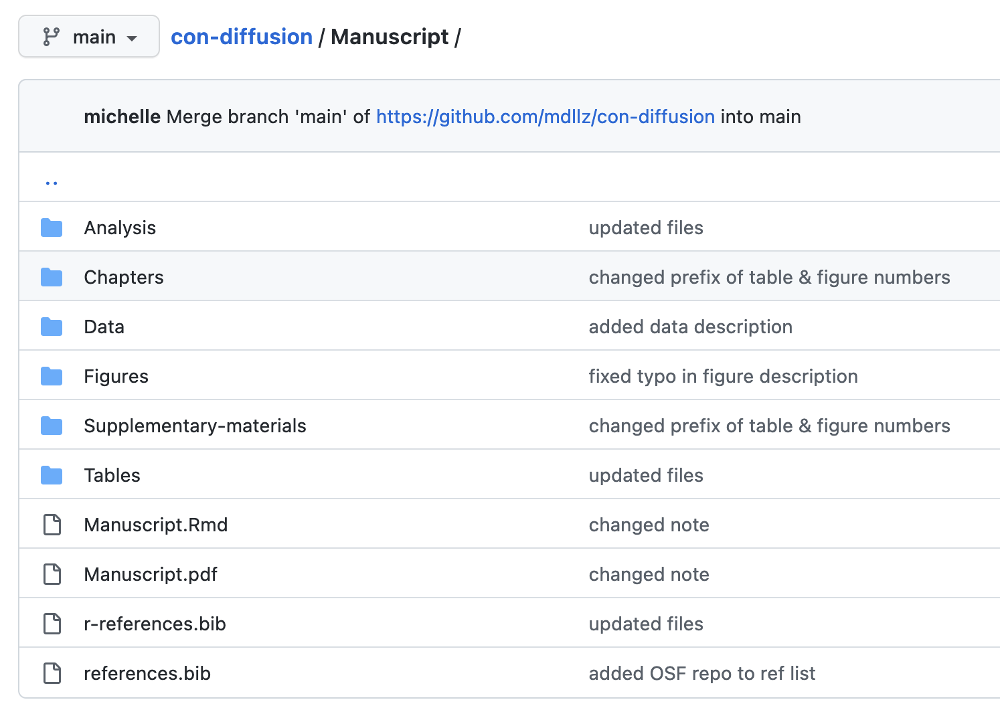
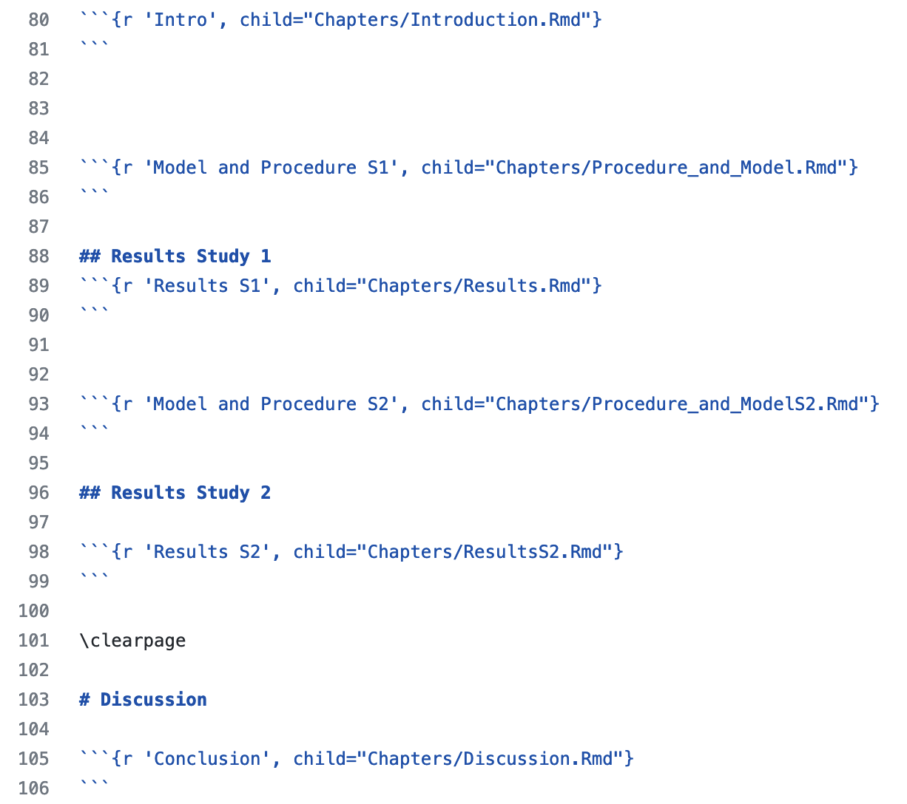
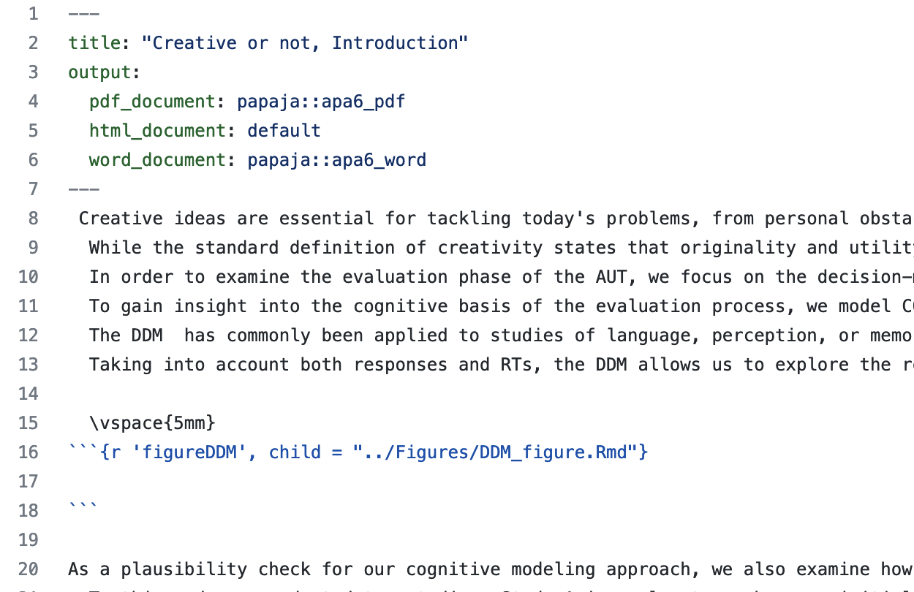

```{r setup, include=FALSE, echo = F}
knitr::opts_chunk$set(echo = TRUE)

library("msm")
library("papaja")
load("mixed_data.rdata")

```

## Slides and Material

You can find the slides and materials here: <https://github.com/jstbcs/ReproducibleWorkflowWorkshop>.

Materials heavily build on previous workshops by **Julia Haaf**

## Overview

1.  Minimizing mistakes and reproducibility.
2.  What is `RMarkdown` and how can I use it (e.g., to write a thesis)?
3.  What is `git` and how can I use it?

# 1. Minimizing mistakes and reproducibility.

## Replicability Crisis

-   Failures to replicate [e.g. @Ebersole:etal:2016; @OpenScienceCollaboration:2015; @Wagenmakers:etal:2016b].
-   Fraud [@Bhattacharjee:2013].
-   Improbable findings have been published in top-tier journals [e.g. @Bem:2011].

<br>

<br>


## Proposed Solutions

> -   Change the incentive structure [e.g., @Nosek:etal:2015; @Wagenmakers:etal:2012a].
> -   Be transparent and open [e.g. @Rouder:2016; @Wicherts:etal:2011].
> -   Change the statistical approach [e.g. @Benjamin:etal:2018; @Rouder:etal:2016c; @Erdfelder:2010]

<br>

<br>


## Proposed Solutions

-   Change the incentive structure [e.g., @Nosek:etal:2015; @Wagenmakers:etal:2012a].
-   Be transparent and open [e.g. @Rouder:2016; @Wicherts:etal:2011].
-   Change the statistical approach [e.g. @Benjamin:etal:2018; @Rouder:etal:2016c; @Erdfelder:2010]

<center>

**We assume people do stuff on purpose.**

</center>

<br>

<br>


## Mistakes in Psychological Science

Sources of mistakes:

> -   Errors when programming an experiment or study (e.g. randomization).
> -   Equipment failure (e.g. responses are collected unreliably).
> -   Lost data.
> -   Errors when coding the analysis (e.g. with data cleaning).
> -   Errors when reporting the analysis (e.g. typos).

<br>


## Consequences in data science

> -   Prevalence: Roughly half the publications in 30 years of literature contained at least one malformed statement of a statistical test [@Nuijten:etal:2016]. Do you think these would be caught in an internal presentation in a company?
> -   Bias: Simple mistakes tend to go in scientists' preferred direction [@Gould:1996]. You want to present clear results to your client.
> -   Persistence: Once in the literature mistakes are almost impossible to detect [@Rouder:etal:2019a]. Or, once a change is implemented on a website/at a company it is much more difficult to change it back.

## High-Reliability Organizations \| Principles for Avoiding Mistakes

> 1.  Sensitivity to operations: Focus on processes instead of outcomes.
> 2.  Preoccupation with failure: Look for ways to proactively anticipate and avoid mistakes, and take small mistakes seriously.
> 3.  Resilience in the face of failure and reluctance to simplify: In a resilient team, when things go wrong --- and they will --- people talk about them, document them, and learn from them.
> 4.  Deference to expertise: Each team member has certain expertise.

<br>


## From Principles to Practices

> a.  Adopting a team culture focused on learning from mistakes.
> b.  Implementing radical computer automation.
> c.  Standardizing organizational strategies across team members (everyone documents solutions the same way).
> d.  **Ensuring that statistical analyses are coded.**
> e.  **Developing expanded reports in which documentation of analyses is woven into the documentation files.**


# Reproducibility

## Fully Reproducible

> -   Reproducible analysis.
> -   Reproducible graphs and tables.
> -   Reproducible numbers in text.

## Who Can Reproduce When?

> -   Ideal: [Code containerization](https://hackernoon.com/what-is-containerization-83ae53a709a6).
> -   Minimal: Provide a list of packages and software needed (Open source!).
> -   Utopian: "I will be able to fully reproduce my analysis by 2035."

## Tools for Reproducibility

`git`

> -   Versioning tool for collaboratively working on a product.
> -   Avoid retaining multiple versions of the same work product.
> -   'analysis_final_final_B.R'.
> -   Tutorial: @Vuorre:Curley:2018.

`R Markdown`

> -   Document format embedding code chunks into text documents.
> -   Avoid copy-and-paste of results.
> -   Book: <https://bookdown.org/yihui/rmarkdown/>.

## Short Break (5 minutes)

**If you still need to install some things from [the instructions](https://github.com/jstbcs/ReproducibleWorkflowWorkshop#how-to-prepare) now is a good time.**

<br>

<br>

link: <https://github.com/jstbcs/ReproducibleWorkflowWorkshop#how-to-prepare>

# 2. What is R Markdown and how can I use it?

## General Remarks About Working with `R`

(or, really, just doing data analysis)

<br>

> -   Standardiztion: Think about your folder structure.
> -   Clean coding: Develop your own style guide. Note that you might have to adopt your future team's style.
> -   Use comments throughout the analysis (`R Markdown` can help).
> -   Use relative paths ("../material/example-paper.pdf" instead of "/home/julia/Documents/Git/ReproducibleWorkflowWorkshop/material/example-paper.pdf")!
> -   We could have an entire lecture just on this topic. Now is the time for you to adopt good habits!

## What is `R Markdown`?

<br>

> -   Document format embedding code chunks into Markdown documents.
> -   What's Markdown? "A lightweight markup language."
> -   Easy-to-read and easy-to-write plain text format. Easier than latex (but supports latex).
> -   Supports many output formats (html, pdf, ms word, ...)

## Basic Rules of Markdown \| Header

```{r, eval = F}
# Level 1 Header

## Level 2 Header

### Level 3 Header
```

<header>

<h2>

Level 1 Header

</h2>

<h3>

Level 2 Header

</h3>

<h1>

Level 3 Header

</h1>

</header>

## Basic Rules of Markdown \| Bold and Italic

To write text in bold or in italic, just add \*'s around the word(s)

```{r, eval = F}
You can print one word **bold** and another *italic*.

Or *multiple words* can **be altered**.
```

You can print one word **bold** and another word *italic.*

Or *multiple words* can **be altered**.

## Basic Rules of Markdown \| Lists

```{r, eval = F}
- This
- Is
- A
- List
```

-   This
-   Is
-   A
-   List

## Basic Rules of Markdown \| Overview

Check out the cheat sheets in the folder [material](https://github.com/jstbcs/ReproducibleWorkflowWorkshop/tree/master/material).

## Task I

<br>

Go to [stackedit.io](https://stackedit.io/app#) ➤ Write Markdown!

Use the cheat sheet!

<br>


## `R Markdown` \| What is Possible?

-   Scientific papers
-   Slides
-   HTML sites
-   CVs
-   Books
-   ...

## From Rmd to PDF



## Task II

-   Open `RStudio`.
-   Go to 'File' ➤ 'New File' ➤ 'R Markdown'
-   Add title and author, choose PDF, and click 'ok'.
-   Save the file.
-   Click the 'knit' button.


## YAML header \| YAML = "Yet Another Markup Language"

```{YAML}
---
title: "My first Markdown"
author: "My name"
output: pdf_document
---
```

## YAML header \| YAML = "YAML Ain't Markup Language"

```{YAML}
---
title             : "Creative or Not? Hierarchical Diffusion Modeling of the Creative Evaluation Process"
shorttitle        : "Creative or Not?"

author: 
  - name          : "Michelle C. Donzallaz"
    affiliation   : "1"
    address       : "Nieuwe Achtergracht 129-B, 1018 WS Amsterdam"
    corresponding : yes   # Define only one corresponding author
    email         : "m.c.donzallaz@uva.nl"  
  - name          : "Julia M. Haaf"
    affiliation   : "1"
  - name          : "Claire E. Stevenson"
    affiliation   : "1"
```

## YAML header \| continued...

```{YAML}
affiliation:
  - id            : "1"
    institution   : "University of Amsterdam"
  
authornote: |
  This report was written in R-Markdown with code for data analysis integrated into the text. The source code and the data can be found at: https://osf.io/73c2d/. (...) 

note: "\\copyright American Psychological Association, 2022. This paper (...)"   
abstract: |
  (...) 
  <!-- https://tinyurl.com/ybremelq -->
  
bibliography      : ["references.bib", "r-references.bib"]

```

## YAML header \| continued...

```{YAML}

keywords          : "creativity, evaluation, diffusion model, Bayesian hierarchical modeling"
floatsintext      : yes
figurelist        : no
tablelist         : no
footnotelist      : no
figsintext        : yes
linenumbers       : no
mask              : no
draft             : no
nocite: ["@Singmann:2018", "@Barchard:2012", "@DonzallazEtAl:2022"]
header-includes:
  - \raggedbottom
documentclass     : "apa6"
classoption       : "man, noextraspace"
output            : papaja::apa6_pdf
---
```

## R code chunks

    `r ''````{r name, options = ...}
    1 + 1
    ```

```{r, echo = F}
1+1
```

> -   Code chunks include code (languages other than R also possible, e.g., Python).
> -   Code is executed when knitting a R Markdown file.
> -   In R Studio you can use the shortcut `Ctrl + alt + i` to insert a code block.
> -   No underscore in chunk name, no name twice.

## Chunk options

> -   `eval = FALSE`
> -   `echo = FALSE`
> -   `warnings = FALSE`
> -   `cache = TRUE`
> -   `child = "rmdfilename.Rmd"`
> -   See [rmarkdown-cheatsheet2](https://github.com/jstbcs/ReproducibleWorkflowWorkshop/blob/master/material/rmarkdown-cheatsheet2.pdf) for most important options.

## Global chunk options {.build}

Adjust all chunk options in a Rmd file with the following command:

```{r, eval = F}
knitr::opts_chunk$set(echo = TRUE)
```

**Pro-tip:** If the R chunks are too long use `source()` to load `R`-files, and the chunk option `child = myanalysis.Rmd` to include other `R Markdown` files.

## Check out papaja!

-   "Prepare APA Journal Articles with R Markdown"
-   [R package](https://github.com/crsh/papaja) developed by Frederik Aust with great [documentation](https://frederikaust.com/papaja_man/)!
-   create computationally reproducible, submission-ready manuscripts (or theses!)

## Example: folder structure on GitHub



## Example: Manuscript/Manuscript.Rmd



## Example: Manuscript/Chapters/Introduction.Rmd



## Example: Manuscript/Chapters/Results.Rmd


## Task III

-   Go back to your `Rmd` file.
-   Add a chunk calculating the standard deviation (`sd()`) of the speed of cars.
-   Print the results in a sentence below the chunk.
-   Knit the PDF.
-   Not happy with result? Round it!


## Inline R-Code


This is an inline expression `r sd(cars$speed)` in the output.

```{r}
sdcars <- sd(cars$speed)
```

The standard deviation of the speed of cars is `r round(sdcars, 2)`.

## $\mathbf{\LaTeX}$

> -   You can add $\mathbf{\LaTeX}$ code to your text.
> -   Math mode for formulas.

## $\mathbf{\LaTeX}$

-   You can add $\mathbf{\LaTeX}$ code to your text.
-   Math mode for formulas.

<br>

```{r, eval = F}
You can simply add a formula: $\frac{SD}{\sqrt{N}}$.
```

**Result:**

You can simply add a formula: $\frac{SD}{\sqrt{N}}$.

## Math mode and R code

You can use R within math mode.

## Math mode and R code

You can use R within math mode.

```{r}
sd1 <- 15
n1 <- 17
```

## Math mode and R code

You can use R within math mode.

```{r}
sd1 <- 15
n1 <- 17
```

```{r eval = F}
$se = \frac{`r sd1`}{\sqrt{`r n1`}} \approx `r round(sd1/(sqrt(n1)), 2)`$
```

$se = \frac{`r sd1`}{\sqrt{`r n1`}} \approx `r round(sd1/(sqrt(n1)), 2)`$


## References

```{=html}
<style>
slides > slide {
  overflow-x: auto !important;
  overflow-y: auto !important;
}
</style>
```
```{=html}
<style>
slides > slide:not(.nobackground):before {
  background: none;
}
</style>
```
<font size="3">

::: {#refs}
:::

</font>
