```{r setup, include=FALSE}
knitr::opts_chunk$set(echo = FALSE)
```

## A crash course

[http://julia.ntzwrk.net/talks/git_sios_2021.html#1](http://julia.ntzwrk.net/talks/git_sios_2021.html#1)

# Why should we use computer science tools in science?

## Replicability Crisis

- Failures to replicate [e.g. @Ebersole:etal:2016; @OpenScienceCollaboration:2015; @Wagenmakers:etal:2016b].
- Fraud [@Bhattacharjee:2013].
- Improbable findings have been published in top-tier journals [e.g. @Bem:2011].

<br>

<br>


## Proposed Solutions

- Change the incentive structure [e.g., @Nosek:etal:2015; @Wagenmakers:etal:2012a].
- Be transparent and open [e.g. @Rouder:2016; @Wicherts:etal:2011].
- Change the statistical approach [e.g. @Benjamin:etal:2018; @Rouder:etal:2016c; @Erdfelder:2010]

<br>

<br>


## Proposed Solutions

<center>
**We assume people do stuff on purpose.**
</center>

<br>

<br>

<br>

<br>


## Things People Don't Do on Purpose

Mistakes

- Errors when programming an experiment or study (e.g. randomization).
- Equipment failure (e.g. responses are collected unreliably).
- Lost data.
- Errors when coding the analysis (e.g. with data cleaning).
- Errors when reporting the analysis (e.g. typos).

<br>


## Consequences

- Prevalence: Roughly half the publications in 30 years of literature contained at least one malformed statement of a statistical test [@Nuijten:etal:2016].
- Bias: Simple mistakes tend to go in scientists’ preferred direction [@Gould:1996]. 
- Persistence: Once in the literature mistakes are almost impossible to detect [@Rouder:etal:2019a].

## Coding helps

- Coding your analysis instead of "clicking" it leaves a trail.
- Working with others on code in team science (check each others' work!).
- Share your code with others.

>- **Version control can help!**


## Version control

>- Version control is a system that records changes to a file or set of files over time so that you can recall specific versions later.
>- History of all changes (who, what, when).
>- Helps to avoid mistakes (working on the wrong version, deleting, ...).
>- Merging changes of multiple collaborators in one file.


## Do I Want to Use git or github?

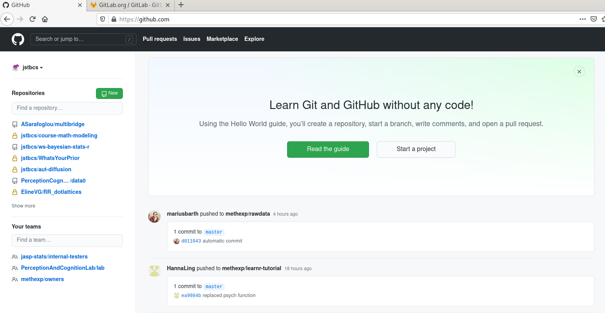

## Do I Want to Use git or github?

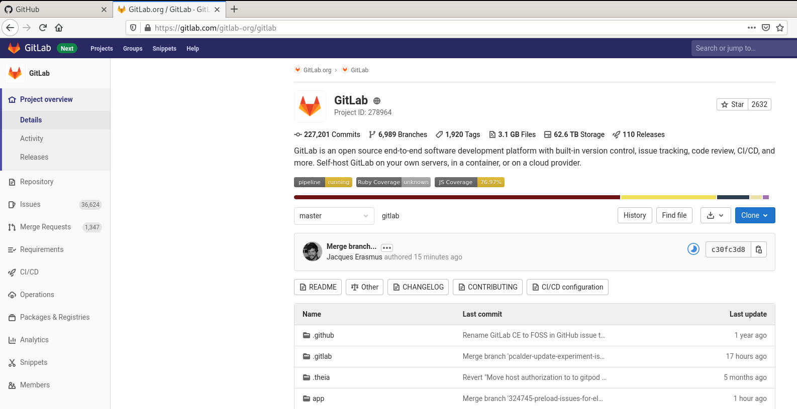

## Do I Want to Use git or github?

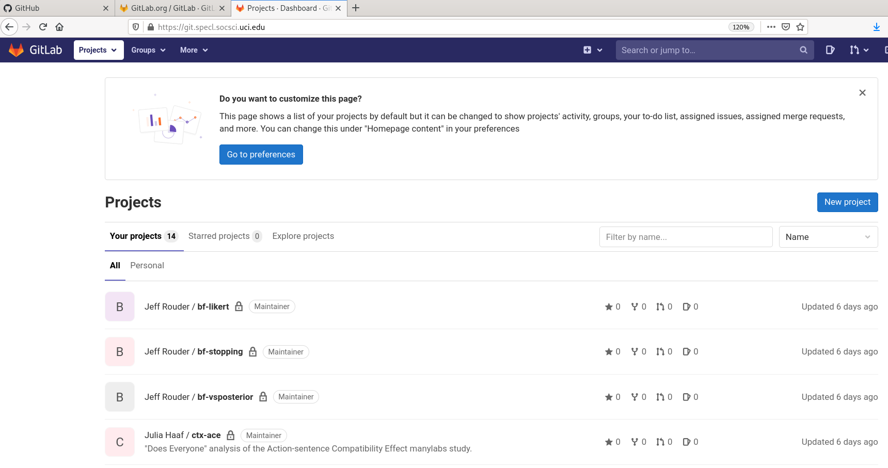

## Do I Want to Use git or github?

  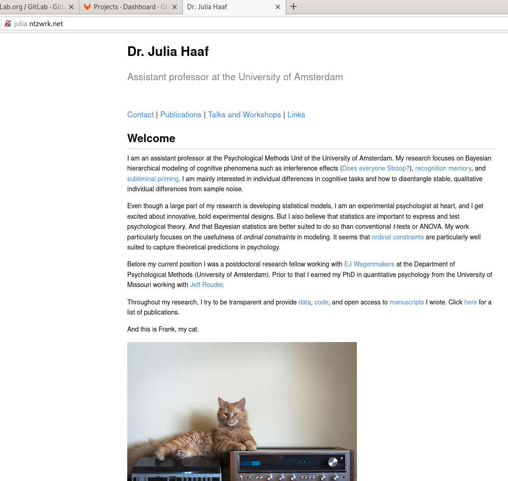
  
  <br>

  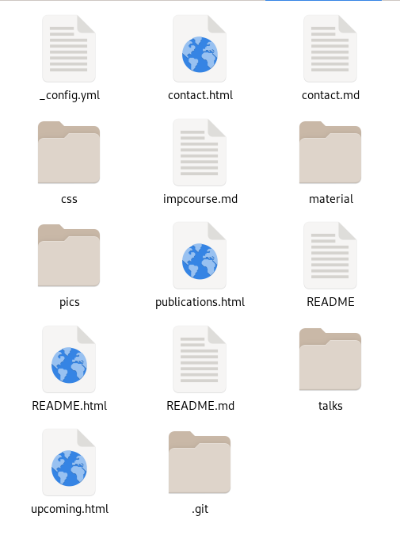
  
## Do I Want to Use git or github?

**github**

>- One platform that uses git as version control system.
>- Provides free and easy storage of repositories (projects).
>- Widely used.

**git**

>- A very popular version control system.
>- The status quo in IT.
>- A mature and developed system - not really for beginners!

>- **Learning to navigate github is for now, learning gitis for life!**

## What I would like to show you about `git`

<div class="left-col">
* How to use a terminal
* Git
  + What is it good for?
  + What is it?
  + What can it do?
* Set-up for your computer
  + GUI/terminal
  + R Studio & git
  + SSH
  + Set name & email address
</div>

<div class="left-col">
  + Your first repo
    - Github and GitLab
    - In R Studio
    - gitignore
    - README

* Workflow
  + Add, Commit, Push
  + Diff
  + Merge, Branches, Tagging... (all the cool stuff)
  + What happens if something goes wrong? (And it will.)

</div>

## What we have time for

<div class="left-col">
* *How to use a terminal*
* Git
  + **What is it good for?**
  + **What is it?**
  + What can it do?
* Set-up for your computer
  + *GUI/terminal*
  + **R Studio & git**
  + *SSH*
  + Set name & email address
</div>

<div class="left-col">
  + Your first repo
    - *Github and GitLab*
    - **In R Studio**
    - **gitignore**
    - **README**

* Workflow
  + **Add, Commit, Push**
  + Diff
  + Merge, Branches, Tagging... (all the cool stuff)
  + What happens if something goes wrong? (And it will.)

</div>

## What is it?


## What can it do?

- A lot! Which is why I can only mention part of its functionality here.
- Working on one product in (large) teams.
- Working on things that can break.
- git can only integrate and show changes in text files.
- binary files (images, pdf, etc.) can be tracked and uploaded but changes cannot be shown.

# Setup for your computer

## Using git

>- Git does not have a user interface. 
>- You can either use the terminal, or install an additional interface.
>- Github has its own GUI. Some people like it. 
>- We will use Rstudio as user interface.

## R Studio & git

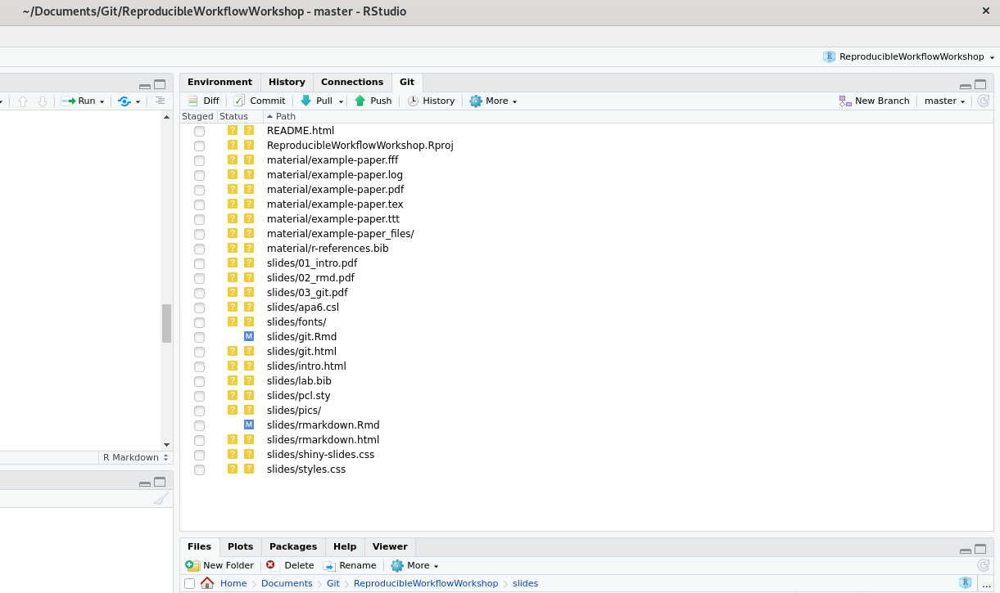

## R Studio & git

Tools &#10148; Global Options &#10148; Git/SVN.

Make sure the first box is ticked and the "git.exe" (Windows) is included in the first box.


## Set name & email address

- Open the Terminal in R Studio.
- Set an email address and user name for git.

```{r eval = F, echo = T}
git config --global user.email "myemail@email.com"
git config --global user.name "My commit name"
```

<br>

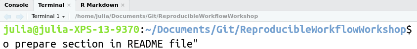

# First Repository!

## Github 

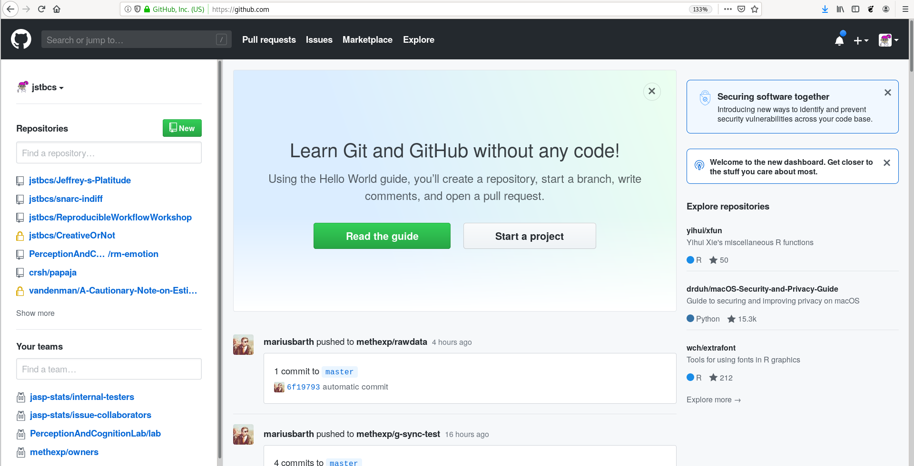

## Github | New Repository


## Github | New Repository

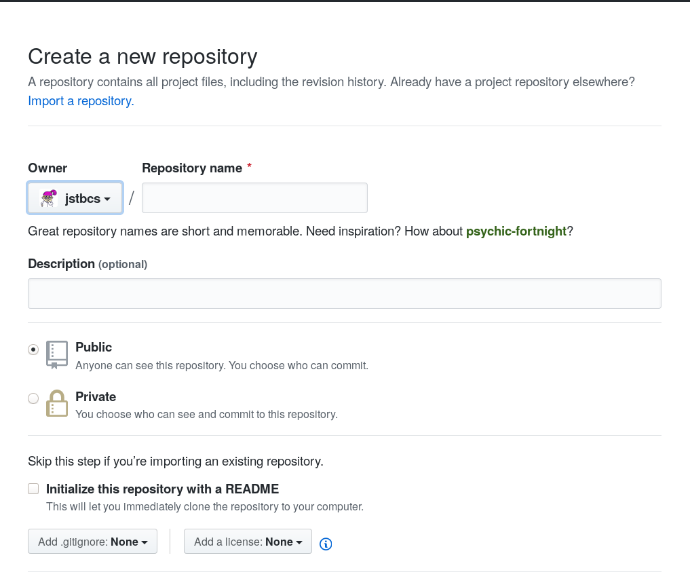

## Github | New Repository

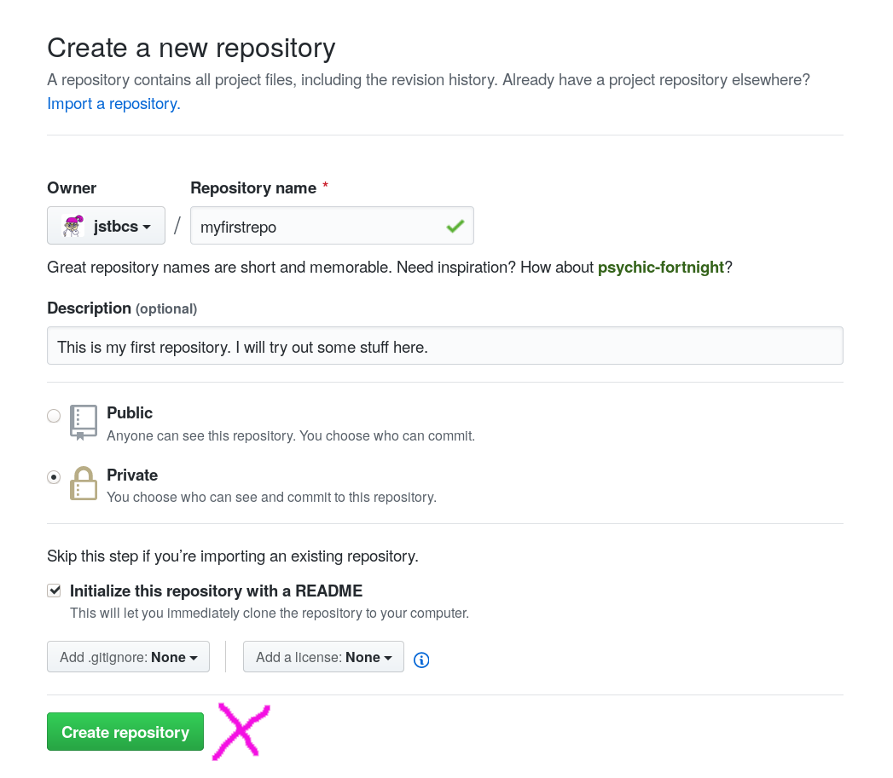

## Github | Settings


## Github | Settings


## Github | Settings

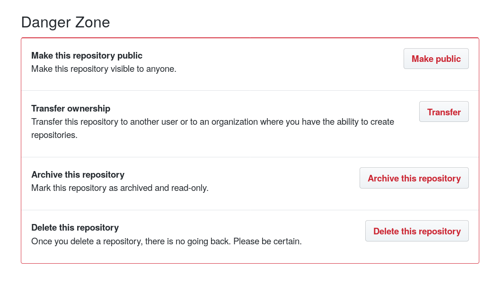

## Github | Clone It!


## In R Studio

File &#10148; New Project &#10148; Version Control &#10148; Git


## In R Studio

- You will have to type in you user name and password for github.
- Initializes a local git repository with an R project (opening a clean R Studio session when opening).
- You can see the README file from github.
- Adds a `.gitignore` file.

<br>

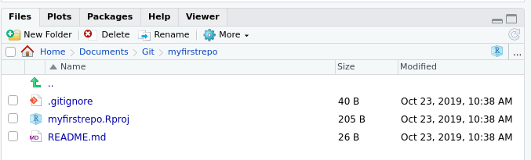

<!-- ## Task IV -->

<!-- - Make a new repository. -->
<!-- - Clone it using R Studio to make a local repository. -->

<!-- <br> -->

<!-- <br> -->

<!--   -->

## gitignore

>- Specifies intentionally untracked files to ignore.
>- Each line in a `gitignore` file specifies a pattern.
>- R Studio pre-specifies some useful patterns.
>- For R Markdown: Cache files! .tiff, .eps, .rdb, .rdx

<br>


## README


## README

- Tell other people (and yourself in a year) why your project is useful, what they can do with your project, and how they can use it.
- On github default README files are Markdown files.

<br>

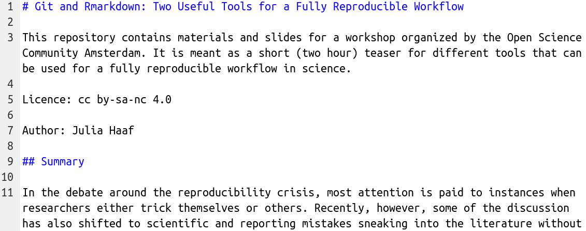

<!-- ## Task V -->

<!-- - Write a (short) README file for your test repository.  -->
<!-- - Use Markdown formatting. -->

<!-- <br> -->

<!-- <br> -->

<!--   -->

# Git Workflow

## Do some work

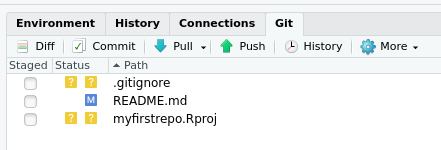 

## Git Add

 

<br>

```{r eval = F, echo = T}
git add .gitignore myfirstrepo.Rproj
```

- `git` does autocomplete for file names in the terminal!
- Note that many user interfaces combine `git add` and `git commit` (next step).

## Git Commit

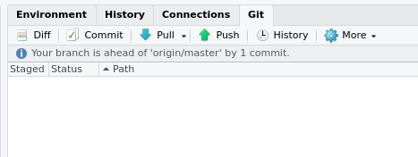 

<br>

```{r eval = F, echo = T}
git add .gitignore myfirstrepo.Rproj
git commit -am "My first commit"
```

Commits always have a commit message.

## Commit message

<br>

 

## Git Push

 

```{r eval = F, echo = T}
git add .gitignore myfirstrepo.Rproj
git commit -am "My first commit"
git push
```

Congrats! You have done it! Now local and remote repositories are up to date!

<!-- ## Task VI -->

<!-- - Add your unstaged files. -->
<!-- - Commit the changes. -->
<!-- - Push to the remote repository. -->

<!-- <br> -->

<!--   -->

## Git Pull

Before you start working on the project the next time:

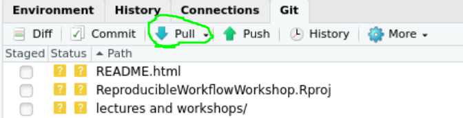 

```{r eval = F, echo = T}
git pull
```

Pull, work some more, repeat.

## What changed since the last commit?

```{r eval = F, echo = T}
git diff
```

 

## What happens if something goes wrong? (And it will.)

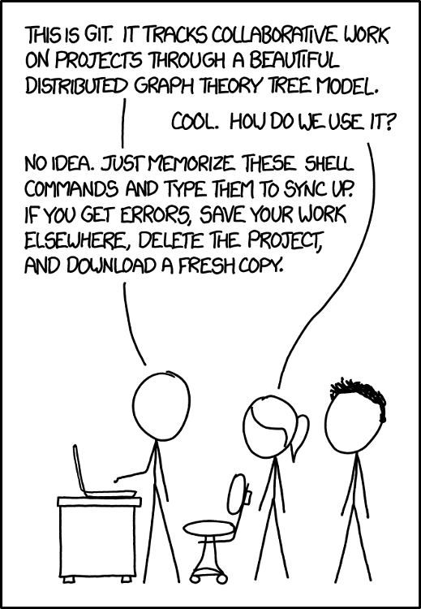

## What happens if something goes wrong? (And it will.)

First things first: You cannot break things.

## What happens if something goes wrong? (And it will.)

Read the output!

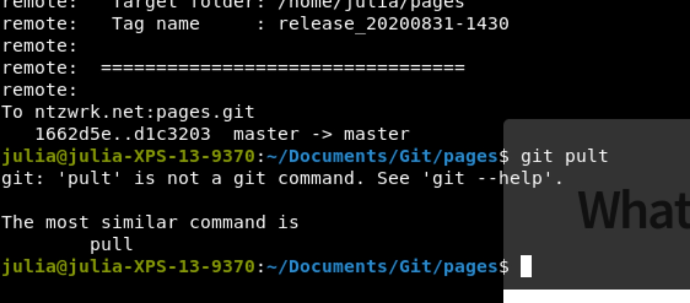

## Push Conflict

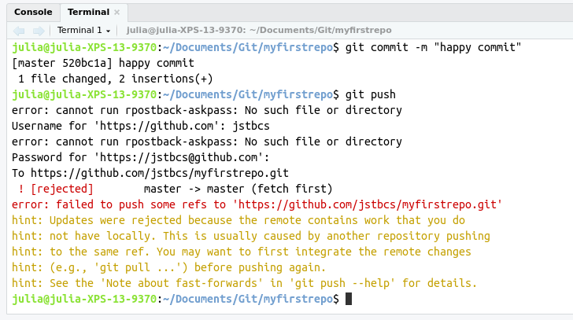 

## Merge Conflict

 

## Merge Conflict

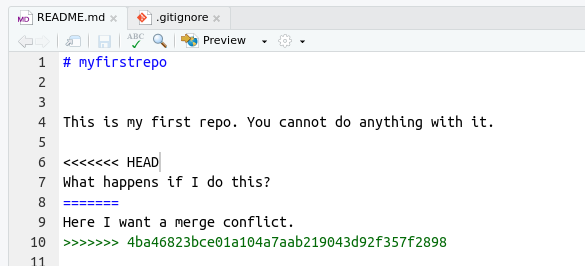 

>- Resolve the conflict (Choose which changes to keep).
>- Commit, and Push.

## How to avoid merge conflicts | Or: Do not mess with the master

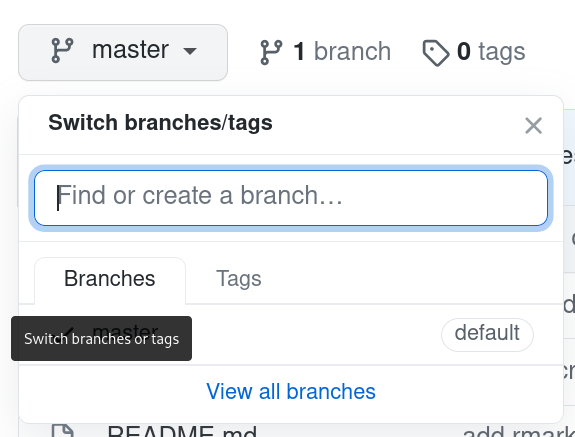 

## Do not mess with the master

 

- The master branch is *deployable*: It contains the final product code.
- This is not where people work.
- Instead you use *branches* for development and then *merge* the code into the master branch once you are done.

## Do not mess with the master

I don't really have time to get into this

- Here is the best [tutorial](https://thenewstack.io/dont-mess-with-the-master-working-with-branches-in-git-and-github/) I could find on branches: [https://thenewstack.io/dont-mess-with-the-master-working-with-branches-in-git-and-github/](https://thenewstack.io/dont-mess-with-the-master-working-with-branches-in-git-and-github/).
- For working in a professional environment: A tutorial on pull requests: [https://www.atlassian.com/git/tutorials/making-a-pull-request](https://www.atlassian.com/git/tutorials/making-a-pull-request)

## Summary

>- Add, commit, push, pull.
>- Use it!
>- git documentation and error tracking are great!

## Your turn! 

- I made a little assignment so that you can try out git for yourself.
- [http://julia.ntzwrk.net/material/practice.html](http://julia.ntzwrk.net/material/practice.html)
- Be patient, don't panic!

<br>


## Thank you!

Additional info:

Vuorre, M., & Curley, J. P. (2018). Curating Research Assets: A Tutorial on the Git Version
Control System. *Advances in Methods and Practices in Psychological Science, 1*(2), 219–236.

Further references:

<style>
slides > slide {
  overflow-x: auto !important;
  overflow-y: auto !important;
}
</style>

<style>
slides > slide:not(.nobackground):before {
  background: none;
}
</style>

<font size="3">
<div id = "refs"></div>
</font>


