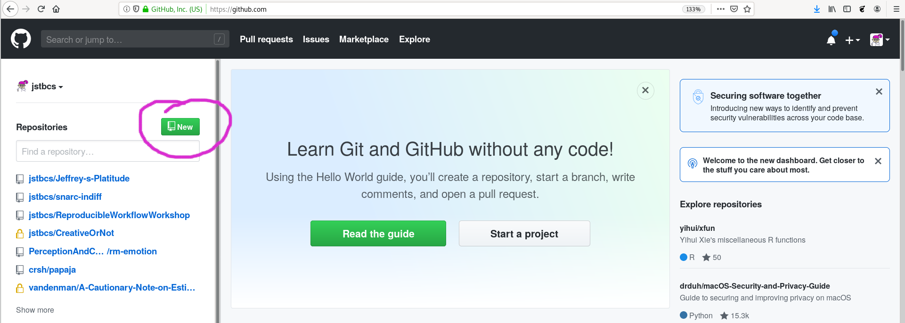
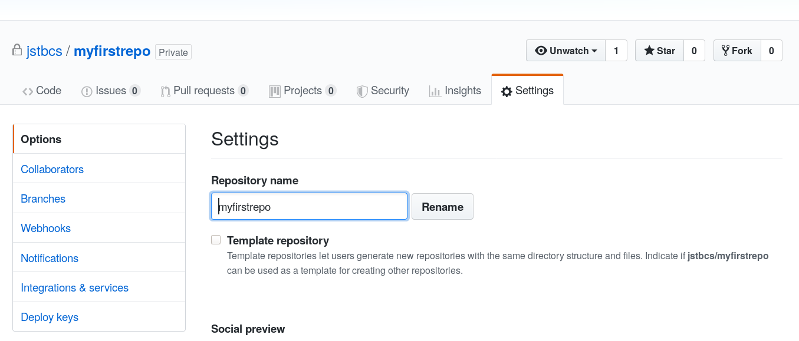
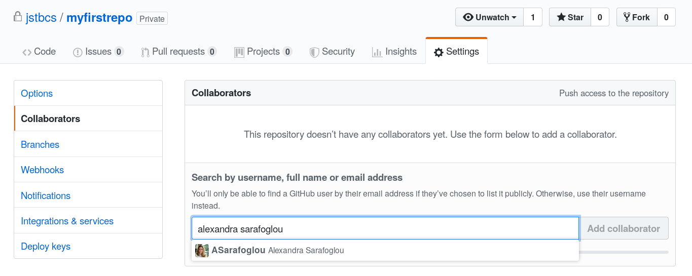
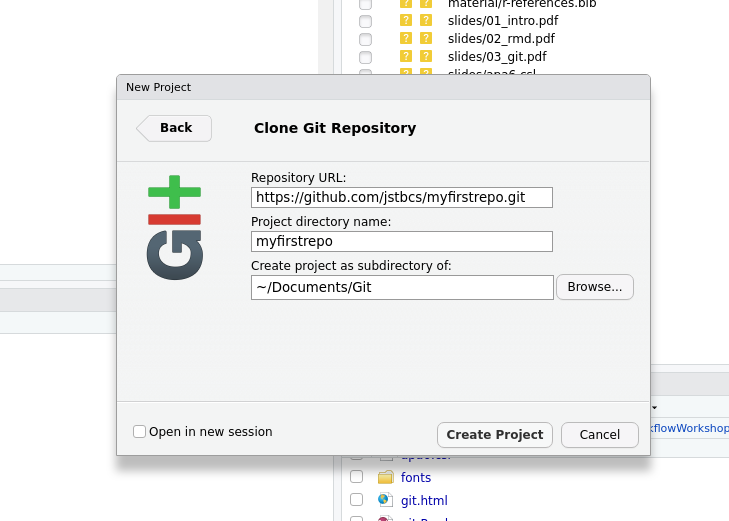
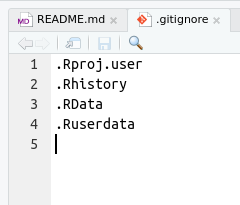
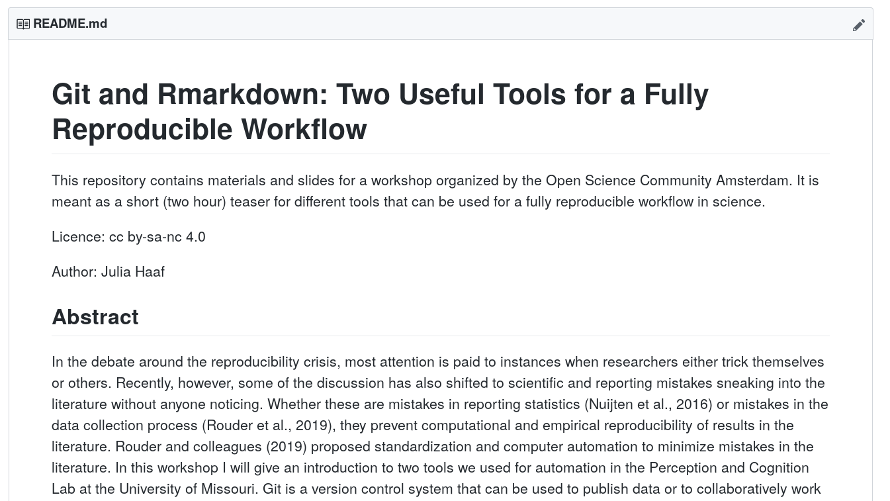
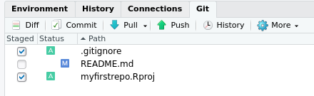
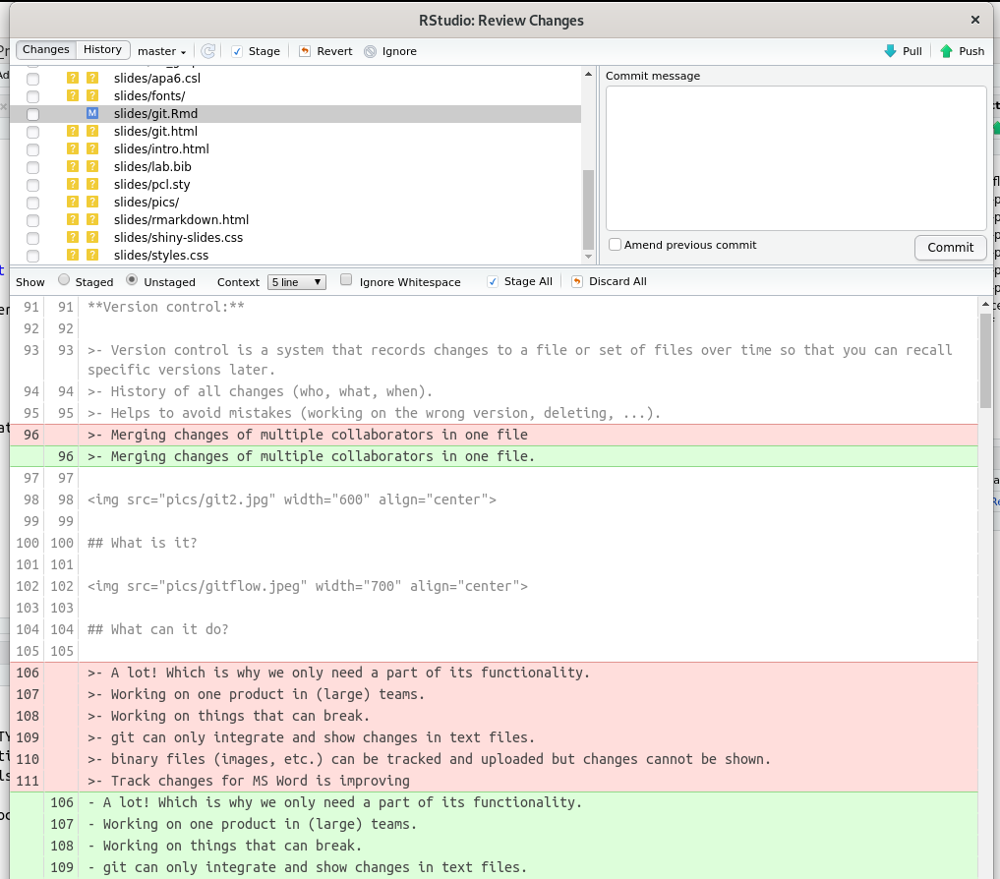

```{r setup, include=FALSE}
knitr::opts_chunk$set(echo = FALSE)
```

## Format

>- This is a workshop.
>- But it is short.
>- We will do some hands-on stuff but there is not a lot of time for practice.

## Slides and Material

You can find the slides (and additional materials) here:
[https://github.com/jstbcs/ReproducibleWorkflowWorkshop](https://github.com/jstbcs/ReproducibleWorkflowWorkshop).

## Who Am I?

Julia Haaf

Assistant Professor at the Psychological Methods Department, University of Amsterdam

email: j.m.haaf@uva.nl

*Job alert:* Two temporary assistant professor positions at the Psychological Methods Unit

## Who Are You?

<br>

<br>


## Overview

1. How can we minimize mistakes in psychological science?
2. What does it mean to have a fully reproducible pipeline?
3. What is `git` and how can I use it?
4. Using `git` for radically open data.

# 1. How can we minimize mistakes in psychological science?

## Replicability Crisis

- Failures to replicate [e.g. @Ebersole:etal:2016; @OpenScienceCollaboration:2015; @Wagenmakers:etal:2016b].
- Fraud [@Bhattacharjee:2013].
- Improbable findings have been published in top-tier journals [e.g. @Bem:2011].

<br>

<br>


## Proposed Solutions

>- Change the incentive structure [e.g., @Nosek:etal:2015; @Wagenmakers:etal:2012a].
>- Be transparent and open [e.g. @Rouder:2016; @Wicherts:etal:2011].
>- Change the statistical approach [e.g. @Benjamin:etal:2018; @Rouder:etal:2016c; @Erdfelder:2010]

<br>

<br>


## Proposed Solutions

- Change the incentive structure [e.g., @Nosek:etal:2015; @Wagenmakers:etal:2012a].
- Be transparent and open [e.g. @Rouder:2016; @Wicherts:etal:2011].
- Change the statistical approach [e.g. @Benjamin:etal:2018; @Rouder:etal:2016c; @Erdfelder:2010]

<center>
**We assume people do stuff on purpose.**
</center>

<br>

<br>


## Mistakes in Psychological Science

Sources of mistakes:

>- Errors when programming the experiment (e.g. randomization).
>- Equipment failure (e.g. responses are collected unreliably).
>- Lost data.
>- Errors when coding the analysis (e.g. with data cleaning).
>- Errors when reporting the analysis (e.g. typos).

<br>


## Lab Practices Under the Microscope

Think about your own experience:

>- Is there time pressure to collect data?
>- Are there checks for coding experiments/surveys?
>- Are there checks for running analyses?

<br>


## Consequences

>- Prevalence: Roughly half the publications in 30 years of literature contained at least one malformed statement of a statistical test [@Nuijten:etal:2016].
>- Bias: Simple mistakes tend to go in researchers’ preferred direction [@Gould:1996].
>- Persistence: Once in the literature mistakes are almost impossible to detect [@Rouder:etal:2019a].

## High-Reliability Organizations | Principles for Avoiding Mistakes

>1. Sensitivity to operations: Focus on processes instead of outcomes.
>2. Preoccupation with failure: Look for ways to proactively anticipate and avoid mistakes, and take small mistakes seriously.
>3. Resilience in the face of failure and reluctance to simplify: In a resilient lab, when things go wrong --- and they will --- people talk about them, document them, and learn from them.
>4. Deference to expertise: Each lab member has certain expertise.

<br>


## From Principles to Practices

>a. Adopting a lab culture focused on learning from mistakes.
>b. **Implementing radical computer automation.**
>c. Standardizing organizational strategies across lab members.
>d. **Ensuring that statistical analyses are coded.**
>e. Developing expanded manuscripts in which documentation of analyses is woven into the manuscript files.


# 2. What does it mean to have a fully reproducible pipeline?

## Science vs. Pseudo-Science

<blockquote>
“An article about computational results is advertising, not
scholarship. The actual scholarship is the full software
environment, code and data, that produced the result.” Claerbout & Karrenbach, 1992
</blockquote>

## Fully Reproducible

>- Reproducible analysis.
>- Reproducible graphs and tables.
>- Reproducible numbers in text.

## Who Can Reproduce When?

>- Ideal: [Code containerization](https://hackernoon.com/what-is-containerization-83ae53a709a6).
>- Minimal: Provide a list of packages and software needed (Open source!).
>- Utopian: "I will be able to fully reproduce my analysis by 2035."

## A Tools for Reproducibility

`git`

>- Versioning tool for collaboratively working on a product.
>- Avoid retaining multiple versions of the same work product.
>- 'paper_final_final_B.docx'.
>- Tutorial: @Vuorre:Curley:2018.

## Short Break (5 minutes)

**If you need help installing some things from [the instructions](https://github.com/jstbcs/ReproducibleWorkflowWorkshop#how-to-prepare) now is a good time.**

<br>

<br>

link: https://github.com/jstbcs/ReproducibleWorkflowWorkshop#how-to-prepare

# 3. What is `git` and how can I use it?

## What I would like to show you about `git`

<div class="left-col">
* How to use a terminal
* Git
  + What is it good for?
  + What is it?
  + What can it do?
* Set-up for your computer
  + GUI/terminal
  + R Studio & git
  + SSH
  + Set name & email address
</div>

<div class="left-col">
  + Your first repo
    - Github and GitLab
    - In R Studio
    - gitignore
    - README

* Workflow
  + Add, Commit, Push
  + Diff
  + Merge, Branches, Tagging... (all the cool stuff)
  + What happens if something goes wrong? (And it will.)

</div>

## What we have time for

<div class="left-col">
* *How to use a terminal*
* Git
  + **What is it good for?**
  + **What is it?**
  + What can it do?
* Set-up for your computer
  + *GUI/terminal*
  + **R Studio & git**
  + *SSH*
  + Set name & email address
</div>

<div class="left-col">
  + Your first repo
    - *Github and GitLab*
    - **In R Studio**
    - **gitignore**
    - **README**

* Workflow
  + **Add, Commit, Push**
  + Diff
  + *Merge, Branches, Tagging... (all the cool stuff)*
  + What happens if something goes wrong? (And it will.)

</div>

## What is it good for?

**Version control:**

>- Version control is a system that records changes to a file or set of files over time so that you can recall specific versions later.
>- History of all changes (who, what, when).
>- Helps to avoid mistakes (working on the wrong version, deleting, ...).
>- Merging changes of multiple collaborators in one file.


## What is it?


## What can it do?

- A lot! Which is why we only need a part of its functionality.
- Working on one product in (large) teams.
- Working on things that can break.
- git can only integrate and show changes in text files.
- binary files (images, etc.) can be tracked and uploaded but changes cannot be shown.
- Track changes for MS Word is improving.

# Set-up for your computer

## R Studio & git


## R Studio & git

Tools &#10148; Global Options &#10148; Git/SVN.

Make sure the first box is ticked and the "git.exe" (Windows) is included in the first box.


## Set name & email address

>- Open the Terminal in R Studio.
>- Set an email address and user name for git.

## Set name & email address

- Open the Terminal in R Studio.
- Set an email address and user name for git.

```{r eval = F, echo = T}
git config --global user.email "myemail@email.com"
git config --global user.name "My commit name"
```

# My first repo

## Github 


## Github | New Repository



## Github | New Repository


## Github | New Repository


## Github | Settings



## Github | Settings



## Github | Settings


## Github | Clone It!


## In R Studio

File &#10148; New Project &#10148; Version Control &#10148; Git



## In R Studio

- You will have to type in you user name and password for github.
- Initializes a local git repository with an R project (opening a clean R Studio session when opeing).
- You can see the README file from github.
- Adds a `.gitignore` file.

<br>


## Task IV

- Make a new repository.
- Clone it using R Studio to make a local repository.

<br>

<br>

 

## gitignore

>- Specifies intentionally untracked files to ignore.
>- Each line in a `gitignore` file specifies a pattern.
>- R Studio pre-specifies some useful patterns.
>- For R Markdown: Cache files! .tiff, .eps, .rdb, .rdx

<br>




## README



## README

>- Tell other people (and yourself in a year) why your project is useful, what they can do with your project, and how they can use it.
>- On github default README files are Markdown files!

## Task V

- Write a (short) README file for your test repository. 
- Use Markdown formatting.

<br>

<br>

 

# Git Workflow

## Do some work

 

## Git Add

 

<br>

```{r eval = F, echo = T}
git add .gitignore myfirstrepo.Rproj
```

<br>

<br>

`git` can do autocomplete for file names!

## Git Commit

 

<br>

```{r eval = F, echo = T}
git add .gitignore myfirstrepo.Rproj
git commit -am "My first commit"
```

<br>

<br>

Commits always have a commit message.

## Commit message

<br>

 

## Git Push

 

<br>

```{r eval = F, echo = T}
git add .gitignore myfirstrepo.Rproj
git commit -am "My first commit"
git push
```

Congrats! You have done it! Now local and remote repositories are up to date!

## Task VI

- Add your unstaged files.
- Commit the changes.
- Push to the remote repository.

<br>

 

## Git Pull

Before you start working on the project the next time:

<br>

```{r eval = F, echo = T}
git pull
```

<br>

Pull, work some more, repeat.

## What changed since the last commit?

```{r eval = F, echo = T}
git diff
```

 


## What happens if something goes wrong? (And it will.)


## What happens if something goes wrong? (And it will.)

- Remember: You cannot break things.
- Most likely you have a merge conflict.

## Push Conflict

 

## Merge Conflict

 

## Merge Conflict

 

>- Resolve the conflict (Choose which changes to keep).
>- Commit, and Push.

## Summary

>- Add, commit, push, pull.
>- Use it!
>- git documentation and error tracking are great!

# Using `git` for radically open data.

## Open Data

> - Standard: Data on request.
> - @Wicherts:etal:2006: Only 11 % of APA journal authors complied with initial request, an additional 16 % with repeated requests. A full 73 % of author teams never complied.
> - More and more: Data on OSF.
> - Needs to be hand-curated, only published when the paper is published.

## Born-open Data

> - @Rouder:2016
> - For people who are not meticulous.
> - Commitment to radically open data: You can see all data, even the failed pilots.
> - Nightly (or weekly) automatic upload to github.
> - github.com/PerceptionCognitionLab


## Born-open Data | Advantages

> - Increases awareness to make good decisions.
> - No data-management mistakes (no data versions).
> - Automatic backup.
> - Easy data sharing.
> - Long-term availability.

## Born-open Data | Elements

> - Shared local storage across experimental computers.
> - Git or Github repository.
> - Execution and scheduling

## Born-open Data | Elements

- Shared local storage across experimental computers.
- Git or Github repository.
- Execution and scheduling (task scheduler).

```{r eval = F, echo = T}
git add *.dat.*
git commit -m "automatic commit"
git push
```

## Born-open Data | Concerns

>- Not suitable for very large files (neuroimaging data, etc.).
>- Not a properly curated archive.
>- Github repositories can be connected to OSF.
>- Privacy concerns.
>- Being scooped.
>- Being vulnerable.

## References

<style>
slides > slide {
  overflow-x: auto !important;
  overflow-y: auto !important;
}
</style>

<style>
slides > slide:not(.nobackground):before {
  background: none;
}
</style>

<font size="3">
<div id = "refs"></div>
</font>
